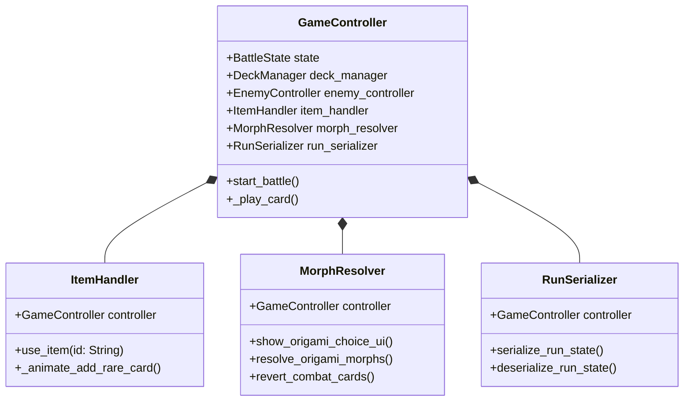

# Implementation Plan - Refactor GameController

`GameController.gd` is currently a large file (~1536 lines) that handles battle orchestrations, consumable item execution, card morphs, and serialization. This refactor splits those auxiliary responsibilities into separate, well-defined components to improve codebase maintainability and readability.

## Refactor Blueprint

We will partition `GameController` into three new sub-components, reducing `GameController.gd` to a concise orchestrator (under 600 lines):

1. **`ItemHandler.gd`**: Manages all item-use logic (Magic Ball, Shield, Remedy Kit, Cup-a-Joe, Moonlight, Snake Oil, Pocketwatch, Velvet Gloves) and Rare card additions (L'Ivoire, Sealed Missive, Curio).
2. **`MorphResolver.gd`**: Manages morph selection choices, morph clash evaluations, Origami swaps, and Plague card reversion.
3. **`RunSerializer.gd`**: Manages deck/discard/draw state serialization and restoration from save files.



---

## Proposed Changes

### 1. Create New Component Scripts

#### [NEW] [ItemHandler.gd](file:///d:/Projects/Gamedev/jank-pot/scripts/game/ItemHandler.gd)
- Create a `RefCounted` class configured with a reference back to `GameController`.
- Migrate:
  - All consumable item request callbacks (`_on_magic_ball_requested`, `_on_shield_requested`, etc.).
  - Velvet Gloves card-picking overlay UI, custom button layout builders.
  - Rare card reward additions (`_on_l_ivoire_requested`, `_on_sealed_missive_requested`, `_on_curio_requested`).
  - Helper functions for picking cards and animating card inserts.

#### [NEW] [MorphResolver.gd](file:///d:/Projects/Gamedev/jank-pot/scripts/game/MorphResolver.gd)
- Create a `RefCounted` class configured with a reference back to `GameController`.
- Migrate:
  - `_show_origami_choice_ui()` choice window/dim backdrop creation.
  - `_get_clash_value()` comparison logic.
  - `_morph_card_to_basic()` card swapping.
  - `_resolve_origami_morphs()` evaluation.
  - `_revert_origami()` and `_revert_plague()` helpers into a unified `revert_combat_cards(card)` call.

#### [NEW] [RunSerializer.gd](file:///d:/Projects/Gamedev/jank-pot/scripts/game/RunSerializer.gd)
- Create a `RefCounted` class configured with a reference back to `GameController`.
- Migrate:
  - `get_run_state()` and `restore_run_state()`.
  - Deck pile serialization (`_serialize_card_history`, `_deserialize_card_history`, `_restore_deck_pile_state`).
  - Pool popping and card base ID retrieval.

---

### 2. Update Main Scene & Controller

#### [MODIFY] [GameController.gd](file:///d:/Projects/Gamedev/jank-pot/scripts/game/GameController.gd)
- Declare variables for the three handlers:
  ```gdscript
  var item_handler: RefCounted
  var morph_resolver: RefCounted
  var run_serializer: RefCounted
  ```
- In `_ready()`, instantiate and configure them:
  ```gdscript
  item_handler = load("res://scripts/game/ItemHandler.gd").new()
  item_handler.configure(self)
  morph_resolver = load("res://scripts/game/MorphResolver.gd").new()
  morph_resolver.configure(self)
  run_serializer = load("res://scripts/game/RunSerializer.gd").new()
  run_serializer.configure(self)
  ```
- Delegate connections and calls:
  - Route shelf item signals to `item_handler.use_item(id)`.
  - Delegation for `get_run_state()` to `run_serializer.get_run_state()`.
  - Delegation for `restore_run_state(state)` to `run_serializer.restore_run_state(state)`.
  - Route Origami/Plague resolving and reversion to `morph_resolver`.
- Delete all migrated code blocks from the file.

---

## Verification Plan

We will run continuous correctness checks throughout the refactoring steps.

### Automated Tests
- Run Godot test suite via command-line:
  `D:\Godot\godot\godot.exe --headless -s tests/TestRunner.gd`
- Verify that every unit test (including combat state, poison, Velvet Gloves, Origami morph choices, and Davy's/Plague resolution) continues to pass cleanly.

### Manual Verification
- Launch the game UI, purchase items in shop (Remedy Kit, Snake Oil, Velvet Gloves, L'Ivoire) and verify item usage behaves correctly.
- Place Origami card, morph it, and check visual morphing and clash outcomes.
- Save and reload progress to confirm serialization maintains stage, deck, and item states.